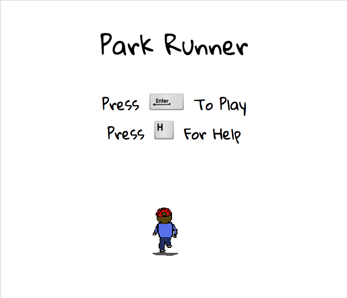
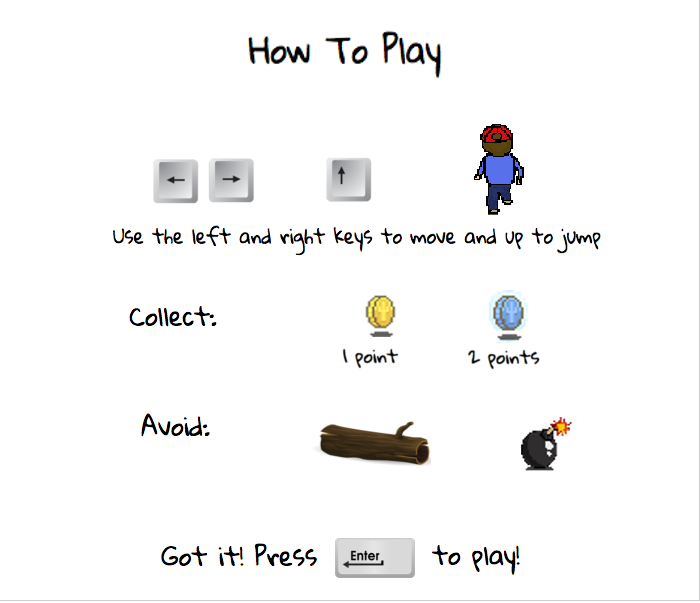
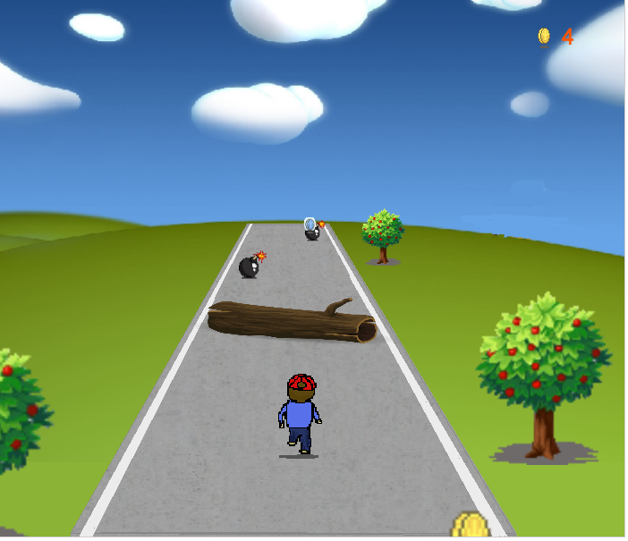
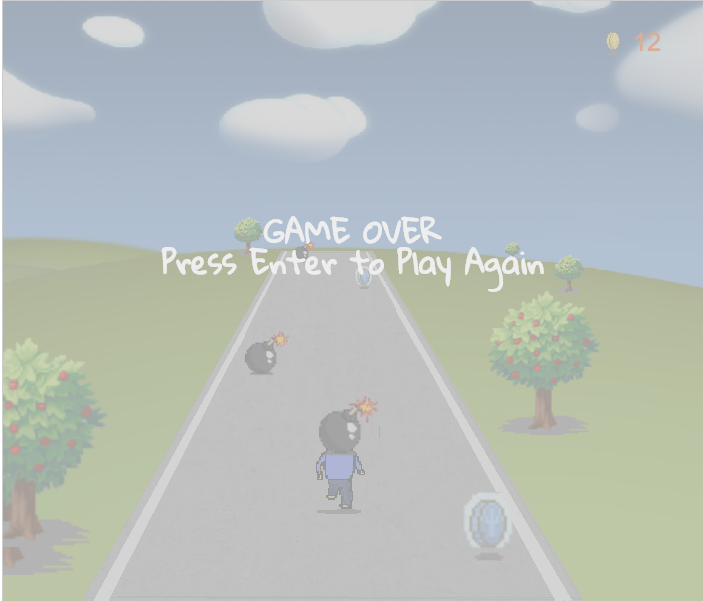

# Park Runner #

Park Runner is an infinite runner game.  You play
as the runner.

## Controls

Left and Right arrow keys: moves the runner to the right, left and center of the road.  
Up arrow key: Jump

## Playing the Game

The game begins with a title screen that displays options for viewing the instructions or playing the game.

Pressing the 'H' key will bring display the How To Play menu.

Pressing the 'enter' key on the title page or How To Play menu will begin the game

The player can control the character to collect as many coins as they can without colliding with the bomb or log.  As the player collects more coins, the speed of items approaching the player speeds up as well.

If they do collide with the obstacles, then a game over modal appears and allows the player to play again by pressing 'enter'.

## To Do's

- [ ] Generate different backgrounds for different levels.
- [ ] Add coin collect sounds and background music.

## More Information

For more detailed information on the various aspects and features, check out my
<a href="./docs/readme.md">design doc!</a>
